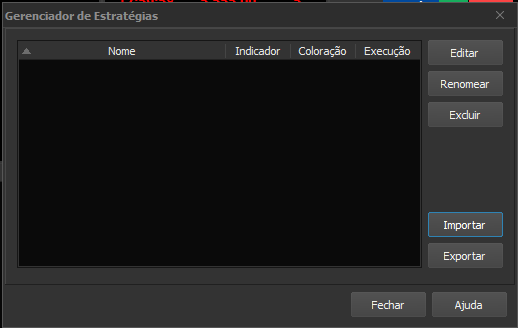

# Indicador Variação da VWAP para Profit

Este indicador permite que as variações da VWAP do fechamento do dia anterior sejam plotadas no gráfico.

As linhas que podem ser plotadas com este indicador são:

+ VWAP do dia anterior
+ 4 variações positivas: +0,5% / +1,0% / +1,5% / +2,0%
+ 4 variações negativas: -0,5% / -1,0% / -1,5% / -2,0%

# Termos de uso

**Os indicadores desenvolvidos por mim tem a finalizade de auxiliar a comunidade de trades do Brasil. Os indicadores foram testados antes de serem disponibilizados, porém não me responsabilizo por algum problema que possa ocorrer, ao utilizar qualquer indicador você concorda que o autor não tem nenhuma responsabilidade por danos causados.**

O código fonte dos indicadores é aberto e está disponível após a instalação, fique a vontade para contribuir, reportar erros e dar sugestões de melhoria.

## Instalação

+ Baixe o arquivo [VariacaoVWAP.psf](VariacaoVWAP.psf)

+ Abra a plataforma Profit e acesse o menu Gerenciador de Estratégias

+ Clique em Importar

+ Selecione o arquivo com a estratégia a ser importada (arquivo baixado anteriormente)

+ Selecione VariacaoVWAP na lista Disponíveis e clique no botão ">" de modo que apareça na lista Selecionadas

+ Clique em Importar

## Como usar o indicador

### Limitações dos indicadores personalizados do Profit

Infelizmente o editor de estratégia do Profit possui algumas limitações listadas abaixo:

+ Só é possível plotar 4 linhas no máximo
+ Não é possível colocar título nas linhas
+ Os parâmetros do indicador só podem ser numéricos
+ Outras limitações técnicas

Para conseguir plotar as 7 linhas em um só gráfico é preciso incluir o indicador VariacaoVWAP 3 vezes conforme os passos a seguir:

1. Clique com o botão direito no gráfico que deseja colocar o indicador e acesse "Inserir Indicador..."

2. Na lista de indicadores procure o indicador VariacaoVWAP

3. Na lista onde tem "Nova Janela Interna", selecione a opção onde o gráfico de barras está e clique em Inserir

4. A linha correspondente à VWAP do dia anterior aparecerá no gráfico

5. Clique com o botão direito em cima dessa linha para configurar o indicador. Selecione opção "Propriedades de VariacaoVWAP[x]". Ou dê 2 cliques em cima da linha para acessar as propriedades.

6. Na janela de propriedades, informe o valor do parâmetro **VariacaoPosNeg** conforme opções abaixo:

   + **0**  = Plota somente a linha com a VWAP do dia anterior
   + **1**  = Plota 4 linhas com as variações positivas da VWAP
   + **2**  = Plota 4 linhas com as variações negativas da VWAP

7. Na aba Aparência, configure o estilo de cada linha conforme sua preferência. Cada linha corresponde a uma variação da VWAP. No caso da opção **0** (somente linha da VWAP) configure somente a Linha 1.

Por causa da limitação do Profit de 4 linhas por indicador, se desejar colocar as demais variações e/ou a linha da VWAP, repita os passos acima e no passo 6 informe outra opção para o parâmetro **VariacaoPosNeg**

Exemplo do gráfico mostrando a VWAP do dia anterior com as respectivas variações (negativas e positivas). Nesse exemplo o indicador foi inserido 3 vezes no mesmo gráfico, cada um com uma opção diferente para o parâmetro **VariacaoPosNeg**.

